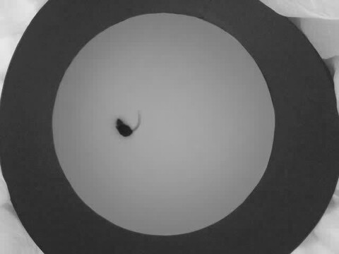
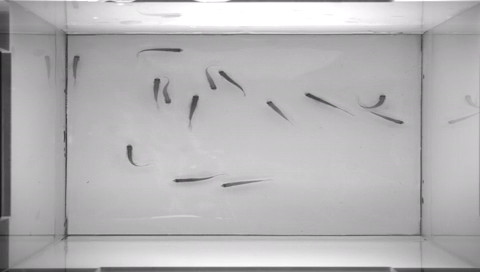

(Awesome*) Laboratory Animal Tracking
=======================

Software, data and publications related to laboratory animal tracking. 

`*` Not fulfilling all requirements of a true [awesome list](https://github.com/sindresorhus/awesome#readme). Although many items on the list are truly awesome, I haven't tested all of them. 

## Overview

[Deep learning powers a motion-tracking revolution](https://www.nature.com/articles/d41586-019-02942-5), Nature, 2019.

## Multiple Animal Tracking

idtracker.ai: Tracking all individuals in large collectives of unmarked animals, 2018. [[website](https://idtracker.ai)] [[paper](https://arxiv.org/abs/1803.04351)] [[code](https://gitlab.com/polavieja_lab/idtrackerai)] #python

Tracktor: image-based automated tracking of animal movement and behaviour, 2018. [[paper](https://www.biorxiv.org/content/10.1101/412262v1.article-info)]  [[code](https://github.com/vivekhsridhar/tracktor)] #python

ToxTrac: a fast and robust software for tracking organisms, 2018. [[paper](https://arxiv.org/abs/1706.02577)] [[code](https://sourceforge.net/projects/toxtrac/)] #windows

Pinpoint: behavioral tracking using 2D barcode tags, 2017. [[code](https://github.com/jgraving/pinpoint)] #python

idTracker: Tracking individuals in a group by automatic identification of unmarked animals, 2014. [[paper](www.nature.com/nmeth/journal/v11/n7/full/nmeth.2994.html)] [[website](http://www.idtracker.es)] #matlab

Ilastik: Interactive learning and segmentation toolkit, 2011. [[website](https://www.ilastik.org/documentation/animalTracking/animalTracking.html)]  [[paper](https://scholar.google.cz/scholar?cluster=8459688359110226056&hl=en&as_sdt=0,5)] [[code](https://github.com/ilastik/ilastik)] #python

Ctrax: The Caltech Multiple Walking Fly Tracker, 2009, [[paper](https://www.nature.com/articles/nmeth.1328)] [[website, code](http://ctrax.sourceforge.net/)] #matlab

ABC Tracker, (to be released). [[website](http://abctracker.org)] #windows #closed_source

## Animal Pose Tracking

DeepPoseKit, a software toolkit for fast and robust animal pose estimation using deep learning, 2019. [[paper](https://elifesciences.org/articles/47994)] [[code](https://github.com/jgraving/deepposekit)] #python

DeepLabCut: Markerless pose estimation of user-defined features with deep learning for all animals, including humans, 2019. [[website](http://www.mousemotorlab.org/deeplabcut)] [[paper](https://www.nature.com/articles/s41593-018-0209-y), [paper](https://www.nature.com/articles/s41596-019-0176-0)] [[code](https://github.com/AlexEMG/DeepLabCut)] #python #3d

DeepFly3D, motion capture (markerless 3D pose estimation) pipeline and helper GUI for tethered Drosophila, 2019. [[paper](https://elifesciences.org/articles/48571)] [[code](https://github.com/NeLy-EPFL/DeepFly3D)] #python

LEAP, a framework for animal body part position estimation via deep learning, 2018. [[paper](https://www.biorxiv.org/content/10.1101/331181v2)] [[code](https://github.com/talmo/leap)] #python

APT - The Animal Part Tracker, 2018. [[website](http://kristinbranson.github.io/APT/)] [[code](https://github.com/kristinbranson/APT)] #matlab

SLEAP: Social LEAP Estimates Animal Poses, (to be released). [[code](https://github.com/talmo/leap)] #python

## Datasets

### With Ground Truth

[Mice Behaviour Analysis Datasets](https://www.iit.it/research/lines/pattern-analysis-and-computer-vision/pavis-datasets/531-mice-behaviour-analysis) 

### Various Animals

[toxtrac](https://sourceforge.net/projects/toxtrac/files/Scientific%20Reports/) 

[idtracker.ai](http://idtracker.ai/en/latest/data.html) 

- 10, 60, 80, 100 zebrafish
- 38, 60, 72, 80, 100 flies

### Zebrafish

Zebrafish tracking using convolutional neural networks, 2017. https://www.nature.com/articles/srep42815, [[video S1](https://media.nature.com/original/nature-assets/srep/2017/170217/srep42815/extref/srep42815-s1.avi), [video S2](https://media.nature.com/original/nature-assets/srep/2017/170217/srep42815/extref/srep42815-s2.avi), [video S3](https://media.nature.com/original/nature-assets/srep/2017/170217/srep42815/extref/srep42815-s3.avi), [video S4P1](https://media.nature.com/original/nature-assets/srep/2017/170217/srep42815/extref/srep42815-s4.avi), [video S4P2](https://media.nature.com/original/nature-assets/srep/2017/170217/srep42815/extref/srep42815-s5.avi)]

idTracker: [example video of 5 zebrafish](http://www.cajal.csic.es/files/gpolavieja/5Zebrafish_nocover_22min.avi)

### Ants

### Bugs

")

")

## License

This work is licensed under a [Creative Commons Attribution 4.0 International License](http://creativecommons.org/licenses/by/4.0/).